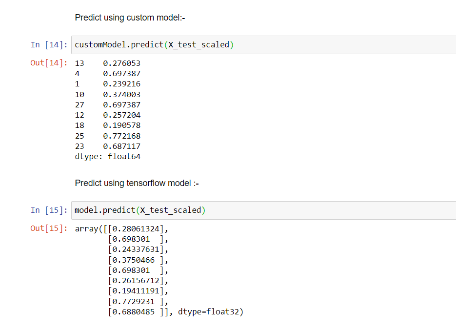

# Neural-Network
In this repository, I have implemented Loss function, Gradient Descent and finally Neural Network
from scratch with the help of insurance dataset. 
Comparision with tensorflow model :-  

